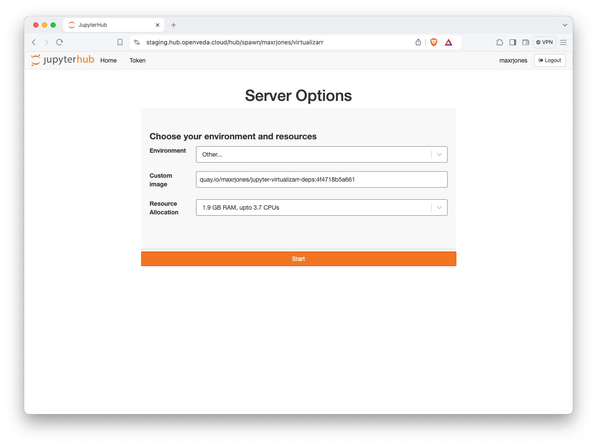

# Curated Docker Image for repo2docker

This repository contains a curated Docker container based on jupyter/base-notebook. It contains VirtualiZarr's dependencies for development on a JupyterHub environment. VirtualiZarr itself is not installed, so that it can be editable installed using a repository already cloned to the shared filesystem.

## Using on a 2i2c Hub

1. Select the "Other" under the **Environment** drop down
2. Enter the docker image name as the Custom Image. Be sure to include the registry and correct tag. Warning that the Hub caches images, which may lead to out of date images if using 'latest' or the date tag. E.g., `quay.io/maxrjones/jupyter-virtualizarr-deps:4f4718b5a661`. View all tags on [Quay](https://quay.io/repository/maxrjones/jupyter-virtualizarr-deps?tab=tags).
    
3. Start the instance
4. [Clone VirtualiZarr](https://github.com/zarr-developers/VirtualiZarr)
5. Navigate to the repostiory, install editable without deps: `python -m pip install -e . --no-deps`
6. Test that it works: `pytest`

## Adding packages

If they are on conda-forge, add the packages to [environment.yml](environment.yml). You can also add requirements.txt for PyPI packages or apt.txt for apt installs, along with other options documented in [repo2docker](https://repo2docker.readthedocs.io/en/latest/).

## Credits

This package was created with [Cookiecutter](https://github.com/cookiecutter/cookiecutter) and the [`maxrjones/cookiecutter-repo2docker`](https://github.com/maxrjones/cookiecutter-repo2docker) project template.
